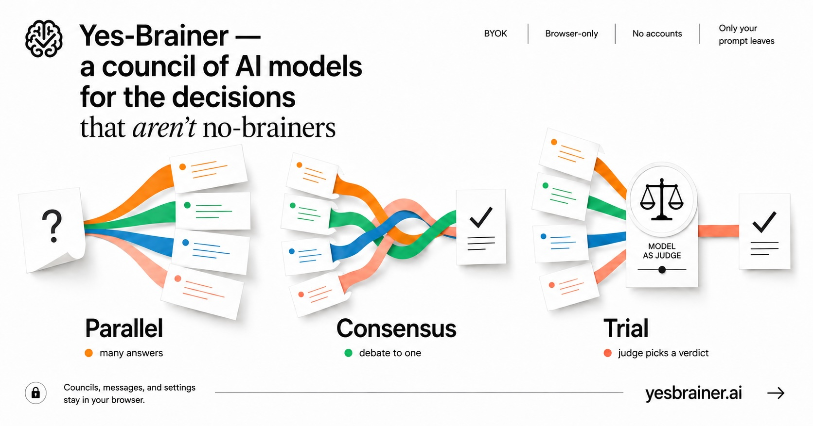
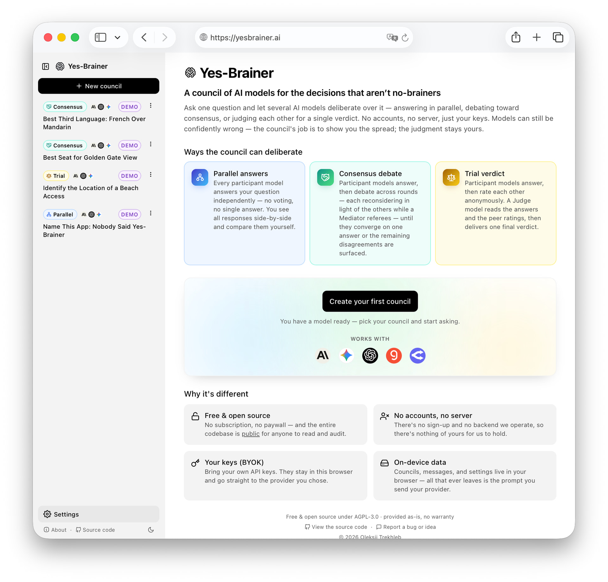
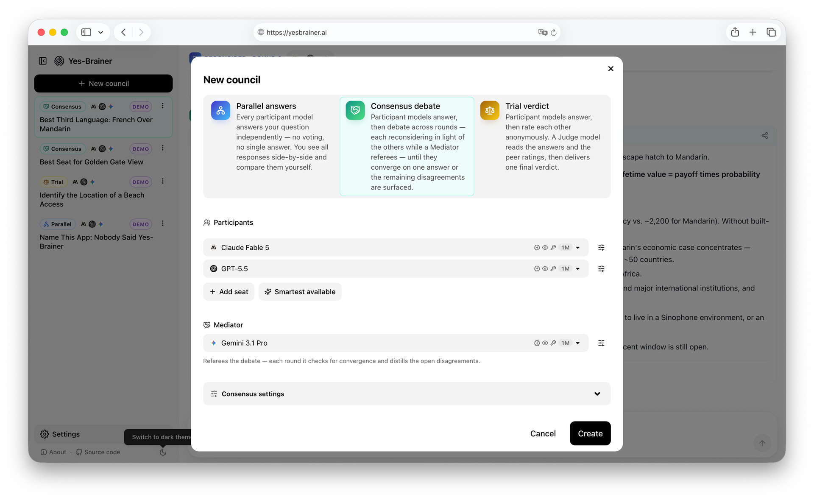
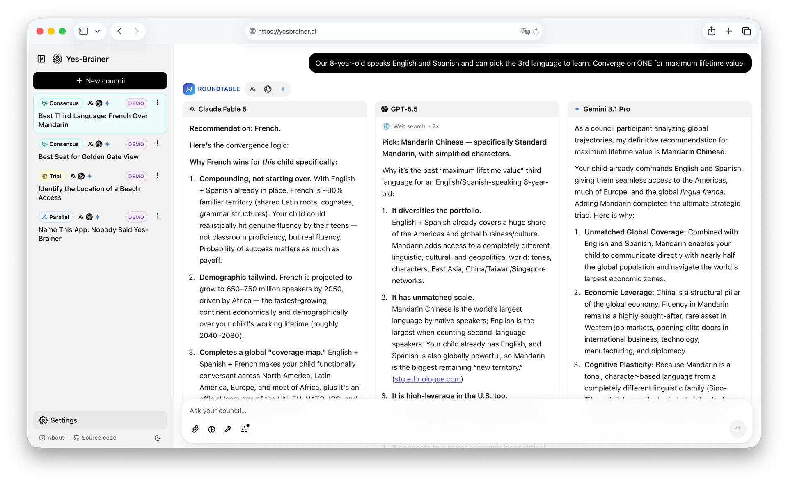
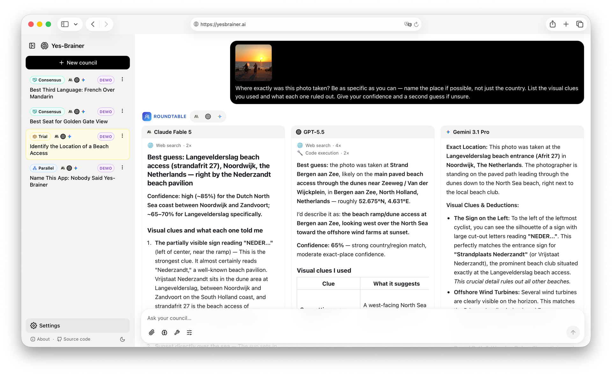
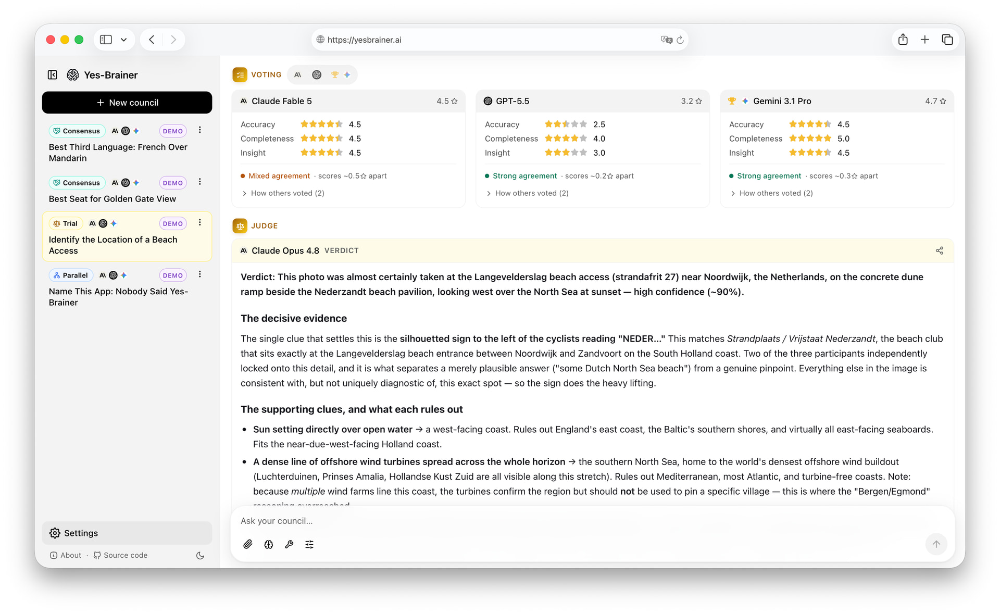
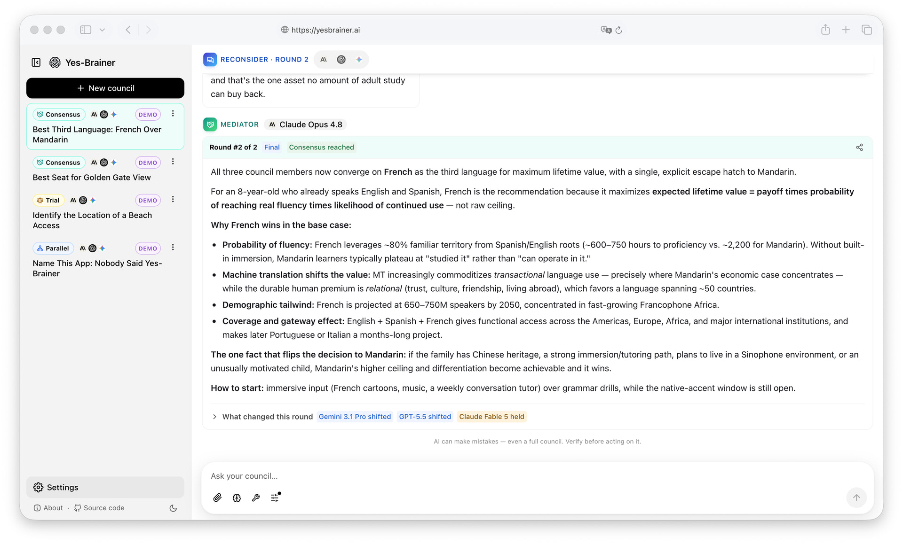
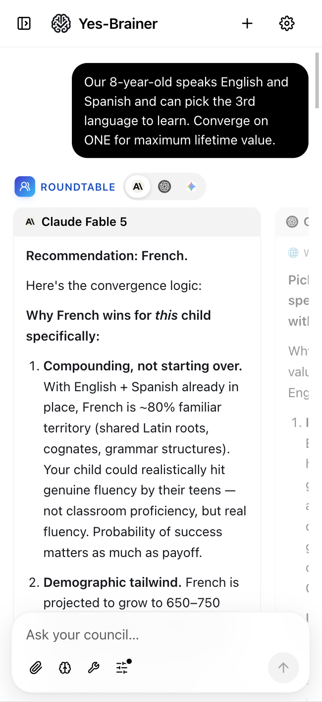
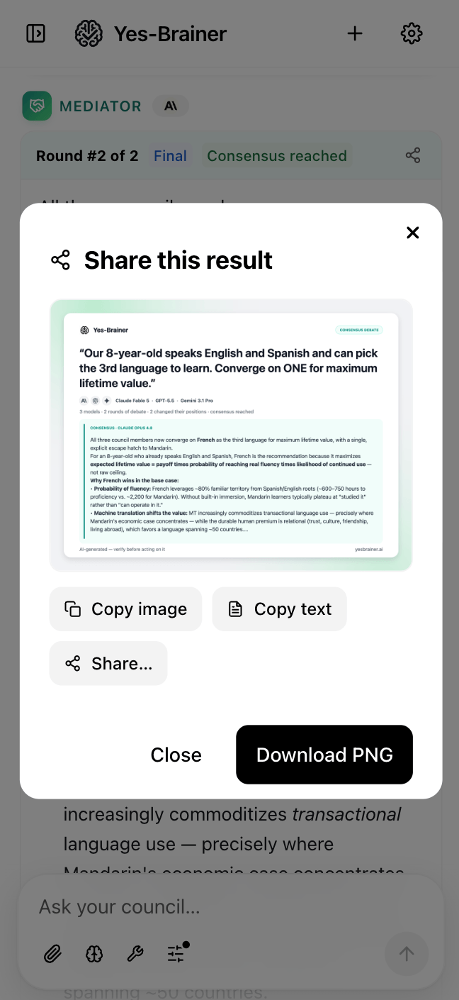
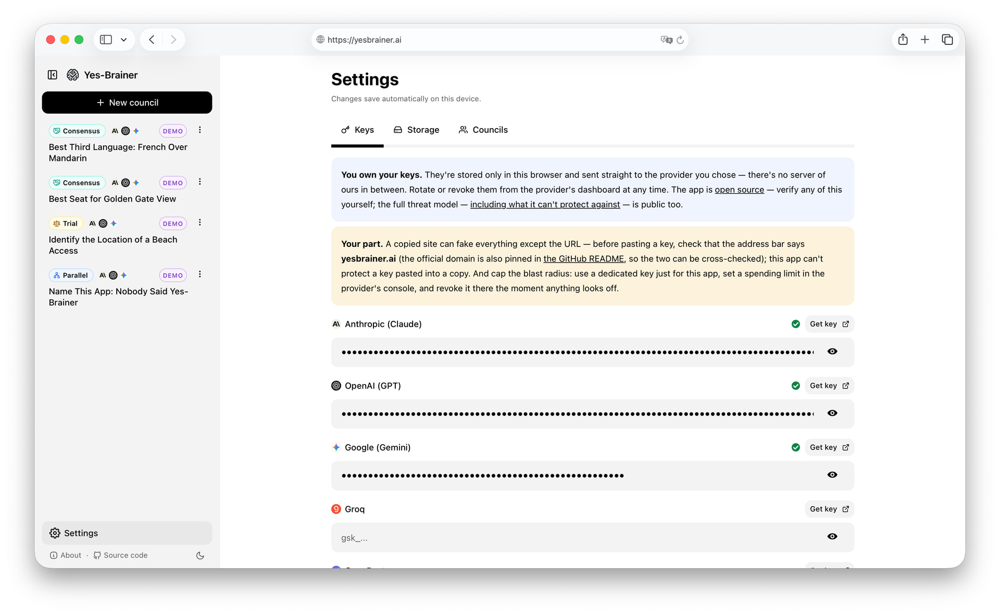

# Yes-Brainer

<a href="https://yesbrainer.ai">
  <picture>
    <source media="(prefers-color-scheme: dark)" srcset="./public/banner-v3-dark.jpg">
    
  </picture>
</a>

> **Yes-Brainer — a council of AI models for the decisions that aren’t no-brainers.** Ask several AI models one question. See where they disagree. One question fans out to several LLMs — and instead of juggling browser tabs, you get a deliberation in one place: independent answers, peer review, debate, a synthesized verdict, the disagreements visible. No account, no server, your own API keys.

**Try it: [yesbrainer.ai](https://yesbrainer.ai)** — the official deployment, built from this repository; treat any other domain as an unofficial copy. No sign-up: paste an API key and ask — or just open the recorded **demo councils** first, no key needed.

- **Three deliberation shapes** — **🔀 Parallel answers** (independent, no synthesis), **⚖️ Trial verdict** (anonymous peer voting + a Judge), **🤝 Consensus debate** (multi-round debate, a Mediator drives convergence).
- **Zero backend, zero accounts, zero data held by anyone but you.** Keys, history, and preferences live in your browser; your prompts and keys travel only to the model providers you choose, directly.
- **Different model providers supported** — Anthropic, OpenAI, Google, Groq, OpenRouter, opt-in Ollama — in one council.
- **No subscription, no paywall** — you pay only your model providers, directly.
- **Mobile-friendly, installable as a PWA**; multi-turn sessions; sidebar of past councils.
- **A static bundle** — GitHub Pages / any CDN; nothing to host, nothing to operate.

<a href="https://yesbrainer.ai">
  <picture>
    <source media="(prefers-color-scheme: dark)" srcset="./public/demo/38-homepage.jpg">
    
  </picture>
</a>

*The front page: the three deliberation modes, recorded demo councils in the sidebar, and the get-started card — one screen, no sign-up. Click through to try it.*



*And creating a council is the whole setup: pick the deliberation mode, seat the models (capabilities and context size at a glance), choose who referees — or just hit "✨ Smartest available" and go.*



*Then the council convenes: one question fanned out to every seat, the answers side by side, the disagreement in plain view — the spread is the signal.*

💡 Inspired by [karpathy/llm-council](https://github.com/karpathy/llm-council) — the orchestration concept and his prompt designs (Judge synthesis, peer evaluation) were the starting point. The difference is the shape, not the polish: the original (and most of its 80+ forks) runs one fixed answer → review → synthesize pass behind a local server you have to run, while Yes-Brainer is a zero-backend browser PWA with three deliberation structures — **including a real multi-round debate refereed to convergence (consensus mode)** — multi-turn follow-ups with on-device persistence, anonymized rubric voting with the agreement spread made visible, and a phone-first UI ([how it compares to everything else](#how-it-compares)).

## Your part as a user 

Before pasting an API key into any site claiming to be Yes-Brainer, check that the address bar says **yesbrainer.ai** — this README and the app should agree on that domain, and a copied site can fake everything except its URL. Cap the blast radius too: use a dedicated key just for this app with a spending limit set in your provider's console, and revoke it there the moment anything looks off. The software is provided **as-is, with no warranty** (AGPL-3.0 §§15–16) — [SECURITY.md](./SECURITY.md) spells out what the code protects and what it can't.

## Why this exists

For complex or important questions, one model's confident answer isn't enough — you want several independent takes and a cross-check. Today the ritual is pasting the same prompt into ChatGPT, Claude, Gemini, and other models in multiple browser tabs and eyeballing the differences. This app collapses that into one composer, runs the prompt across all chosen models in parallel, and adds a deliberation layer so the result is a synthesized recommendation with the reasoning visible — not just three opinions side-by-side. More models isn't truth, though: a council reduces single-model blind spots, but every answer is still AI-generated and can be confidently wrong. Treat verdicts as raw material for your judgment — not professional advice — and own the decisions you make with them.



*A council on a question a single answer shouldn't settle: "where exactly was this photo taken?" — the photo attached, three models with live web search and code execution, each listing its clues. This exact council ships as a keyless demo.*

## How it works

**A council is a conversation.** A session has a **roster** of seated participants, a **social structure** (which extra roles are involved and how they interact), per-role **model assignments**, and a **thread of turns**. Each turn runs the user's message through the role sequence dictated by the social structure; the user can keep asking follow-ups.

### LLM roles

| Role | What it does |
|---|---|
| **Participant** | Seated at the table; answers the question. In **Trial**, also votes on others' answers (anonymized). In **Consensus**, re-answers each round — reconsidering its own position in light of peers' anonymized arguments. The roster is a list of Participants. |
| **Host** | Browser-side orchestration code: collects responses, anonymizes for voting, routes to the next role, persists events on-device. Mechanical, not reasoning — not represented in the UI. |
| **Judge** *(optional)* | Reads anonymized answers + votes, emits a single synthesized decision. |
| **Mediator** *(optional)* | Referees a multi-round Participant debate: each round judges whether the Participants have converged; if not, distills their disagreements (anonymized) to seed the next round. Emits the final consensus summary on agreement, or points of agreement + remaining conflicts at the round cap. |

Each role is a prompt template + an I/O contract.

### Social structures

Compositions of roles. Each council picks one at creation (the structure is fixed for the council's lifetime; the roster and every recipe knob stay editable).

- **Parallel answers** — Participants only. Each one answers independently; no voting, no synthesis — you compare the raw answers. (A council of one is just a regular single-model chat.)
- **Trial verdict** — Participants answer → vote anonymously on each other's answers → a Judge synthesizes one final verdict. The votes feed a **leaderboard and an agreement/disagreement view** — you see where the models agreed and where they split *before* the Judge speaks, and the peer-rated best answer wears a ★. **No revision step**, on purpose: Trial is *judgment from authority* — the Judge rules on first-draft answers plus votes. Mind-changing belongs to Consensus.
- **Consensus debate** — a genuine multi-round debate. Every round, **every** Participant re-answers — seeing its own prior answer plus its peers' positions, anonymized under labels that stay stable within a turn (and reshuffle across turns, so brands can't be inferred). A **Mediator** then judges convergence: converged → it writes the final consensus summary; not converged → it distills the live disagreements to seed the next round. Rounds are capped (3 by default, configurable per council); at the cap the Mediator surfaces points of agreement + remaining conflicts. The most expensive mode — roughly `Participants × rounds` model calls.



*Trial verdict: anonymized peer votes (with agreement indicators and the peer-rated winner ★), then the Judge rules — with the decisive evidence spelled out.*



*Consensus debate, the payoff: after two rounds the council converges — and "What changed this round" shows who moved and who held. No fake harmony: at the round cap, remaining conflicts are reported, not smoothed over.*

<p align="center">
  
  &nbsp;
  
</p>

*Mobile is first-class, not an afterthought: the focus-carousel reading flow, and the share card, on a phone.*

## Your data, your keys

**No server of ours sits between you and the models.** The app is a static bundle of HTML/JS/CSS. The network traffic from your browser is calls direct to the model providers *you* chose, with *your* keys — plus one cookieless pageview ping on the official site, disclosed just below.

| Asset | Where it lives | Who else sees it |
|---|---|---|
| **API keys** | Your browser's `localStorage` (key `yesbrainer:keys`), plaintext, per-device | The provider you point them at (and only when you actually send a turn). Nobody else. |
| **Conversations** (councils, turns, role outputs, votes, token totals) | Your browser's IndexedDB via Dexie (`yesbrainer` database) | Nobody holds a copy — no sync, no server-side store. Their *content* reaches only the providers you send turns to (prior turns ride along as chat context). |
| **Settings** (prompts, behavior knobs, view preferences, theme) | `localStorage` (per-key prefixes documented in [DEVELOPMENT.md → Storage layers](./DEVELOPMENT.md#storage-layers)) | Nobody. |
| **Provider API calls** | Direct browser → provider over TLS | The provider you chose. |



*The Keys panel says the same thing this README does — and names your part of the deal, right where the pasting happens.*

**One counter, fully disclosed.** The official site reports pageviews to a self-hosted analytics instance we operate (`stats.yesbrainer.ai`) — no cookies, no client-side identifiers, no third-party scripts running in the page. What's sent: the route *pattern* (from a fixed list like `/council/:id` or `/settings/keys` — actual ids, full URLs, and content aren't part of the payload), screen size, language, the referrer that brought you, and counts of a few feature-level actions (council created/deleted, verdict shared, demo opened, a key added for a provider — the provider name, not the key — Ollama enabled, PWA installed, export/import, storage resets, persistence granted/denied) — *that* a feature was used, not what was in it. Both lists are closed TypeScript types in [`src/analytics/`](./src/analytics/) (a hundred-odd lines, quick to read): keys and conversations have no field to travel in, and widening what analytics may see would be a visible code change, not a config flip. A build of this repo without the deploy-time endpoint (any fork, by default) sends nothing. To switch reporting off in your own browser, set `yesbrainer:analytics-disabled` to `1` in localStorage.

**Practical consequences:**

- **No cross-device sync**. Open the app on a new device → paste your keys, start fresh; JSON export/import (Settings → Storage) is the manual bridge. Optional sync via *your own* cloud (Google Drive / Dropbox) is planned.
- **No reset flow.** If you lose a device you lose the data on it. The provider's dashboard is the source of truth for keys — rotate there; your last export is the source of truth for conversations.
- **Browsers can evict storage** by default. The app requests persistent storage on your first meaningful write so the browser treats your data as user data, not cache; explicit actions (clearing site data, uninstalling the PWA) still wipe — that's why export exists.
- **Ollama is opt-in** — a default-off toggle at the bottom of Settings → Keys. While off, the app **never probes localhost** and Ollama is invisible everywhere; enabling it is the moral equivalent of adding a key.
- **Reachability is checked honestly.** Ollama (when enabled) gets a real ping, re-checked on tab focus. Cloud keys are optimistic — the app doesn't burn tokens just to validate a key; a real auth failure surfaces when you actually send.

**Hardening.** The serverless architecture is deliberately hardened — the full threat model, including what's *not* covered, lives in [SECURITY.md](./SECURITY.md). The load-bearing pieces: a strict **Content-Security-Policy** whose `connect-src` allowlist names only the provider endpoints and the pageview collector above; **secret redaction** on every error path (a provider error that echoes your key persists as `[redacted]`); **schema-validated imports** (a malformed or crafted backup file is reported and skipped, not written); and model output rendered through **sanitized markdown**.

One honest caveat: prompts sent to **OpenRouter** models pass through OpenRouter's gateway before the underlying vendor (that's what its one-key-many-vendors convenience buys). Still BYOK with no server we operate — but not "direct to the vendor you chose" the way the native adapters are.

## Get started

### Get your keys

Paste keys into **Settings → Keys**; the first-run onboarding's "Add your keys" CTA opens the same panel. All cloud keys are optional — the app works with Ollama alone.

| Provider | Get a key |
|---|---|
| **Anthropic** (Claude) | [console.anthropic.com/settings/keys](https://console.anthropic.com/settings/keys) |
| **OpenAI** (GPT) | [platform.openai.com/api-keys](https://platform.openai.com/api-keys) |
| **Google** (Gemini) | [aistudio.google.com/app/apikey](https://aistudio.google.com/app/apikey) |
| **Groq** | [console.groq.com/keys](https://console.groq.com/keys) |
| **OpenRouter** | [openrouter.ai/keys](https://openrouter.ai/keys) — one key routes to many vendors |
| **Ollama** | no key — runs locally; setup below |

Pricing, free tiers, and signup requirements are each provider's own and change on their schedule — check their pages. Local **Ollama** needs no key at all: install from [ollama.com](https://ollama.com), `ollama pull llama3.1`, then flip **"Enable Ollama on localhost"** at the bottom of Settings → Keys (off by default). On the hosted app, start the daemon with `OLLAMA_ORIGINS=<site origin>` so it accepts the cross-origin call.

### Run it locally

```bash
nvm use        # Node version is pinned via .nvmrc; 
npm install
npm run dev-secure    # Vite dev server at https://localhost:5173
```

That's the whole loop — no server to run, no env file, no database. API keys are pasted into the running app (Settings → Keys), never into the codebase. Everything else — HTTPS dev for phones, the test suites, build + deploy — is in [DEVELOPMENT.md → Dev workflow](./DEVELOPMENT.md#dev-workflow).


## How it compares

The multi-LLM space is busy; the honest differences, briefly. Hosted council products ([Council AI](https://council-ai.app/), [Perplexity's Model Council](https://www.perplexity.ai/hub/blog/introducing-model-council)) hold your conversations server-side behind a subscription — no BYOK, no self-host. The 80+ OSS forks of [karpathy/llm-council](https://github.com/karpathy/llm-council) follow its single 3-stage pipeline and need a server you run. Multi-model aggregators ([Big-AGI](https://big-agi.com)'s Beam, [LibreChat](https://github.com/danny-avila/LibreChat), …) put models side by side without a deliberation mechanic. The combination here — open-source AGPL, zero-backend browser PWA, BYOK, an iterative multi-round consensus debate, on-device data — is a slot we haven't found occupied; if you know a closer neighbor, open an issue to make this section more relevant.

## License

[GNU AGPL-3.0](./LICENSE). Use it, study it, modify it, self-host it — and if you serve a modified copy to others, publish your modifications' source. That network clause is the point: this app's trust story is "read the code you're pasting keys into," and AGPL keeps every hosted fork readable too. The license covers the code, not the name: forks must use a different name and must not present themselves as the official app. The software is provided as-is, with no warranty (AGPL-3.0 §§15–16).
